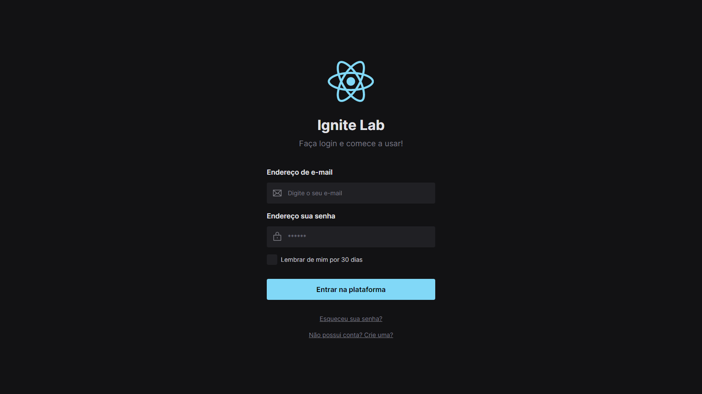
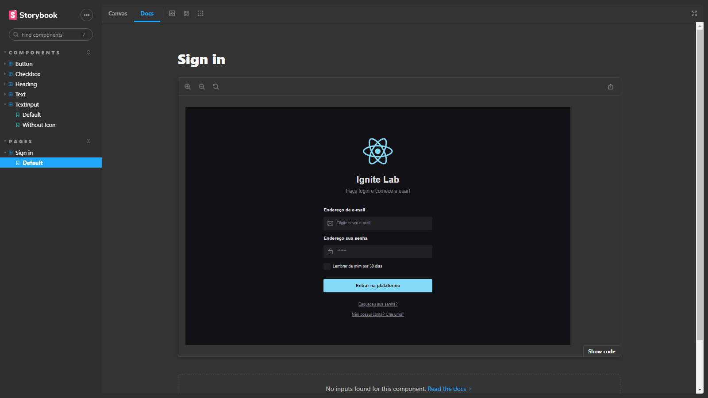

<h1 align='center'>IgniteLab 3 - Design System</h1>

## 🔖 Descrição

Esse é um design system feito a partir dos componentes criados no storybook.

## 🚀 Tecnologias
##### Nesse projeto foi utilizado:

- [ViteJS](https://vitejs.dev/)
- [Typescript](https://www.typescriptlang.org/)
- [Storybook](https://storybook.js.org/)

## Projeto criado a partir dos componentes desenvolvidos:

## Storybook:

## Acesse ao projeto e veja por conta própria:
### - [Deploy](https://savio-anjos.github.io/ignite-lab-design-system/)
